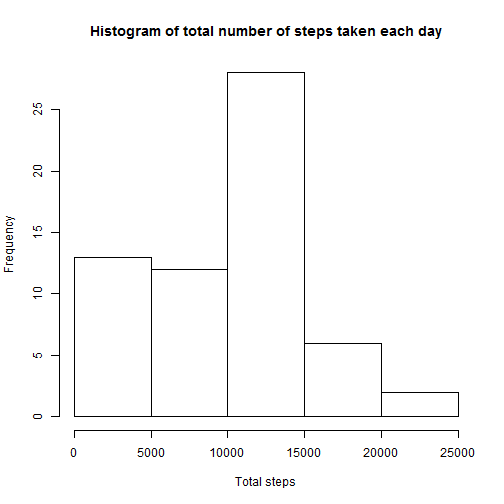
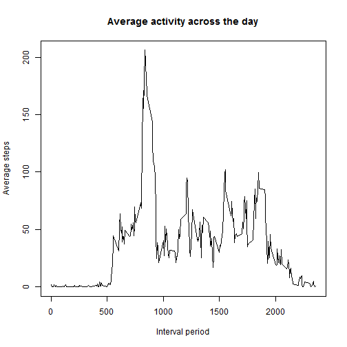
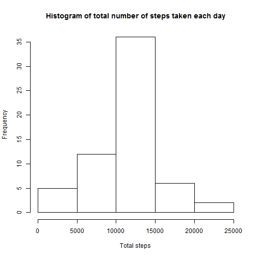
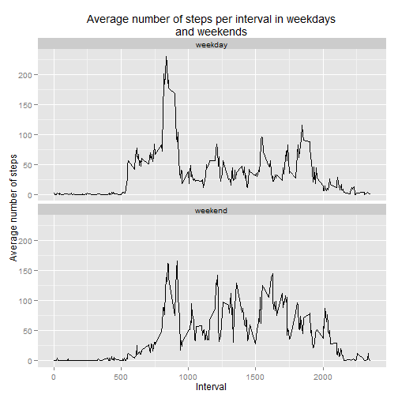

## Loading and preprocessing the data


Read and load the CSV file with the following  
You can download the [activity.zip](https://d396qusza40orc.cloudfront.net/repdata%2Fdata%2Factivity.zip)  
Extract the zip file and place the activity.csv in your working directory with the code
No additional processing is done  


```r
activity <- read.csv("activity.csv")
```


## What is mean total number of steps taken per day?


We will use the dplyr package to help us summarise the information  
We use the group_by function to group the data by date  
All data on the same day are summed together into the variable we will call totalsteps  
All na values are ignored  


```r
library(dplyr)
dailyactivity <- summarise(group_by(activity, date), totalsteps=sum(steps, na.rm=TRUE))
```

We draw the histogram of the activities to give a picture of the information we have  


```r
hist(dailyactivity$totalsteps, xlab="Total steps", main="Histogram of total number of steps taken each day")
```

 

We notice that the lowest bin for the histogram is more frequent, suggesting the NA values have some impact. We will look at this again later  
    
We now calculate both the mean and median of the total steps taken per day.  
The mean (and the answer to the question) is as below  


```r
mean(dailyactivity$totalsteps)
```

```
## [1] 9354
```

```r
median(dailyactivity$totalsteps)
```

```
## [1] 10395
```


## What is the average daily activity pattern?


In order to plot the activity, we will first group the activities by interval  
And perform a mean on those activities, ignoring all na values, into a column called average  


```r
intervalactivity <- summarise(group_by(activity, interval), average=mean(steps, na.rm=TRUE))
```

After obtaining the summarised information, we simply plot them as a line to visually see the average daily activity pattern  


```r
plot(intervalactivity, type="l", 
     main="Average activity across the day", 
     xlab="Interval period", ylab="Average steps")
```

 

In order to find which interval contains the max daily activity, we will use the which.max function to describe which row has the maximum value  
After finding which row, we simply return the interval for that particular row  


```r
intervalactivity[which.max(intervalactivity$average),"interval"]
```

```
## [1] 835
```

## Imputing missing values


First we look at the number of rows that are NA in the data


```r
nrow(activity[is.na(activity$steps),])
```

```
## [1] 2304
```

We look at the percentage to get a clearer idea how much of the data is actually NA


```r
mean(is.na(activity$steps))
```

```
## [1] 0.1311
```

Since the percentage is rather significant (>10%), we would try to fill these NA values with the mean
We adopt a simple strategy to set the mean of the interval for each activity as replacement for these NA values  
We make a copy of the actual activity data.frame to the variable *filled_activity*  
We perform **sapply** with a customised function to return the rounded off value of intervalactivity(obtained from earlier) at that particular interval  


```r
filled_activity <- activity
filled_activity[is.na(filled_activity$steps),]$steps <- 
  sapply(filled_activity[is.na(filled_activity$steps),"interval"], 
         function(x){ round(intervalactivity[intervalactivity$interval==x,"average"])})
```

Using the data from the filled_activity, we proceed to once again summarise the data for each day, the total number of steps taken  


```r
dailyactivity <- summarise(group_by(filled_activity, date), totalsteps=sum(steps, na.rm=TRUE))
```

We will draw the histogram of the activities again  


```r
hist(dailyactivity$totalsteps, xlab="Total steps", main="Histogram of total number of steps taken each day")
```

 

You will notice the data looks more like a normal distribution.  

We now calculate both the mean and median of the total steps taken per day.  


```r
mean(dailyactivity$totalsteps)
```

```
## [1] 10766
```

```r
median(dailyactivity$totalsteps)
```

```
## [1] 10762
```

We can see there is significant difference with the new filled data. The mean and medians are higher (since the missing values were taken as 0 earlier), with the mean more significantly so. Both the mean and the medians are also closer together  

As mentioned earlier as well, the total daily number of steps have not only increased, they have also adopted an appearance closer to the normal distribution.  


## Are there differences in activity patterns between weekdays and weekends?


We first create a new factor, using **sapply** with a custom function, to convert Saturdays and Sundays to weekend, and all other days of the week to weekday  


```r
filled_activity$daytype <- as.factor(sapply(filled_activity[,"date"], 
                                        function(x){ 
                                              w<- weekdays(as.Date(x, "%Y-%m-%d"));
                                              if(w=="Saturday"||w=="Sunday") "weekend" 
                                              else "weekday"
                                              }))
```

Once again we will summarise the activites, grouped by both the interval and the type of day  
The grouped information are then summarised using the **mean** function, into the column called *average*  
Using this data, and **ggplot2** we will create the plot of interval activity, across the intervals and the type of day  


```r
intervalactivity <- summarise(group_by(filled_activity, interval,daytype), average=mean(steps, na.rm=TRUE))
library(ggplot2)
ggplot(intervalactivity, aes(x=interval,y=average)) +   
  geom_line() +     
  xlab("Interval") +
  ylab("Average number of steps") +
  ggtitle("Average number of steps per interval in weekdays\nand weekends") +
  facet_wrap(~ daytype, ncol=1)
```

 

You can observer that during the weekdays, there is a large spike of activity of activity in the mornings. Comparatively over the weekends, the activity is more constant throughout the day.
